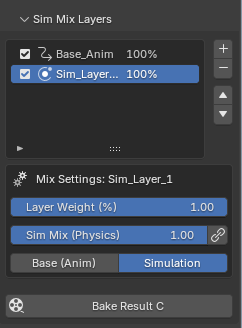

<!-- !!! note (파란색/정보)!!! tip (초록색/팁)!!! warning (주황색/경고)!!! failure (빨간색/에러)!!! bug (분홍색/버그) 
반드시 문구는 스페이스바 4칸 -->

# 🛠️ GroomForge v1.4.0 Official Wiki: Blender to Unreal Engine 5.x
---

## Strategy & Pipeline Overview

🎯 **Advanced Pipeline Solution for Professional Grooming**

GroomForge v1.4.0 is a professional pipeline add-on designed to convert and export Blender Hair Curves into assets optimized for the Unreal Engine 5.x Groom system and 5.7 Hair Dataflow. It implements high-end features—previously exclusive to tools like Maya XGen or Houdini—directly within the Blender environment, providing precise guide control and attribute injection.

  
*Unlocking High-End Rendering Attributes (v1.1.0 Update)*

  
*Unreal Engine MetaHuman Base Template Groom Asset*

  
*Groom Asset created and imported via GroomForge v1.4.0*

### 1. Key Overview
- **Precise Data Conversion:** Fully distinguishes and controls Guide (Value: 1) and Strand (Value: 0) attributes as recognized by Unreal Engine.
- **Root Alignment:** Automatically aligns thousands of hair curve roots to the target mesh (scalp) normals to ensure simulation stability.
- **Automated Rigging Pipeline:** Automates everything from hair accessory generation to bone rigging based on guide curves.
- **MetaHuman Compatible Hair Card Engine:** Generates cards faster than the in-engine generator, supporting length-based packing and color-guide UV placement.
- **UE Optimized Export:** Automatically injects essential professional attributes for engine rendering, including Root UV, ClumpID, and Occlusion.
- **🆕 Send to Unreal Engine:** One click sends your hair straight into a running Unreal Engine Editor as a finished Groom asset — no manual file export/import needed.
- **🆕 Natural, Position-Based Clumping:** Clump IDs are now generated from each strand's real 3D position, so strands that are physically close together are grouped together for a more believable, bundled look.

### 2. Prerequisites & Requirements
- **Installation:** `Edit > Preferences > Add-ons > Install` → Select `GroomForge.zip` and enable.
- **Recommended Environment:** Blender 4.x / 5.x, Unreal Engine 5.x (5.7 recommended for latest features).
- **Required Data:** Blender Hair Curves (Native or 3rd-party add-ons), Target Mesh (Character Head Mesh).

!!! warning
    ⚠️ **Important:** GroomForge v1.4.0 is **not** a hair creation tool.  
It is a pipeline add-on designed to **organize, guide-ize, rig, set attributes, and export** existing hair curves for Unreal Engine 5.x.

### 🚀 Cross-Platform Performance Innovation
GroomForge breaks the boundaries of platforms, engineered to provide peak performance across both Windows and Mac (M1/M2/M3) environments. It ensures engine-level stability even when handling massive grooming datasets.

- **Unmatched Speed:** Achieved **1.4x faster processing speed** on Mac compared to Blender's native features. (Based on 1M Strands)
- **Massive Data Scalability:** Proven stability in processing up to **10 million strands (10M Strands)**.
- **Perfect Precision:** Recorded a **Precision Diff of 0.0000000000** on all platforms, guaranteeing absolute data integrity.

  
*Benchmark conducted on AMD64 / arm64 architectures with Blender 4.5.8 LTS*

---

## Workflow

1. **Prepare Hair Curves** — Complete styling and apply scale (`Ctrl+A`).
2. **Assign Target Mesh** — Prepare the head mesh where the hair will be attached.
3. **Run Root Align** — Precisely align curve roots based on the target mesh.
4. **Use Guide Setting Tools** — Assign guides and automate node setup via **Fix & Output Connect**.
5. **Verify Guide Color View** — Visually inspect the guide and strand configuration.
6. **(Optional) Create Hair Rig Prop** — Generate guide-based accessories and automated rigging.
7. **(Optional) Utilize Hair Card Engine** — Create UE-compatible high-speed hair cards and UV layouts.
8. **Run Advanced Groom Export** — Inject final rendering attributes via **Add Missing Attributes** and export Alembic.
9. **Apply in Unreal Engine 5.x** — Import and verify the Groom asset (integrate with 5.7 Dataflow if necessary).

---

## Technical Manual & Features

### 1. How to Install GroomForge
Go to **Edit > Preferences** in the top menu.  
Select the **Add-ons** tab → click **Install...** → select `GroomForge.zip` → click **Install Add-on**.  
Search for “GroomForge” and check the box to enable it.

---

### 2. Root Align: One-Click Root Alignment
Eliminates the tedious task of manually correcting thousands of curve directions and ensures attachment precision in Unreal.

- **How to use:** Select Hair Curves → Pick Target Mesh → Click **Root Align**.
- **Precision:** Automatically identifies the point closest to the mesh and sets it as the Root, preventing simulation errors where hair floats or roots and tips are swapped.

  
*Even if the curve's start and end points are swapped, it automatically identifies the point closest to the target mesh (head) to reset the Root and correctly realigns the direction.*

---

### 3. Guide Setting Tools & Fix Tool (Attribute Protection)
Precisely defines and protects the Guide attributes required by the Unreal Groom system.

- **Guide 1 / 0:** Manually assign/unassign selected curves as Guides.
- **Select 1 / 0:** Quickly select or invert selection of current Guides.
- **Random Guide:** Convert a specific percentage of hair into guides randomly.

**🆕 Fix & Output Connect:** Automatically builds the necessary node structure to prevent Guide attributes from “bleeding” into strands within Geometry Nodes.

  
*When using Blender Hair Add-ons (e.g., HairBRIC, Hair Tool)*

  
**When using Native Blender Hair Nodes (Geometry Nodes)**

**💡 Pro Tip:** This feature works most intuitively when used in conjunction with the **HairBRIC** add-on.

**🆕 Clump Scale:** Right next to the **Fix & Output Connect** button you'll find a **Clump Scale** slider. This controls how large or small the automatically generated hair clumps are — a lower value creates bigger, chunkier clumps, while a higher value creates smaller, finer clumps. Adjust it and re-run **Fix & Output Connect** to see the difference. Clumps are now based on each strand's real position in 3D space, so nearby strands naturally group together instead of being grouped randomly.

---

### 4. Guide Color View (Visual Inspection)
Final visual verification of data configuration before export. (Guides: Red, Strands: Blue)

  
**When using Blender Hair Add-ons (e.g., HairBRIC, Hair Tool)**

  
**When using Native Blender Hair Nodes (Geometry Nodes)**

!!! warning
    ⚠️ **Warning: Viewport vs. Actual Data**  
Due to the nature of Blender's Geometry Nodes, the real-time Viewport display may differ from the actual Exported data. Use Color View for general distribution and flow checks, but always verify the final data within Unreal Engine.

---

### 5. Guide Protection
This panel provides tools to prevent unintended changes to your Guide data and to inspect the overall data integrity.

- **Fix Guide Count:** Locks the number of currently set Guides.
- **Hair Debug Info:** Displays the current data status of the hair curves.

**💡 Pro Tip:** It is highly recommended to click **Fix Guide Count** after completing all guide setups and executing **Fix & Output Connect**.

---

### 6. Hair Rig Prop Creator (Automated Rigging Pipeline)
Automates accessory generation and rigging using guide curves as the physical skeleton.

- **🆕 Target Bone Selection:** Allows direct selection of a specific Bone within the armature.
- **🆕 Random Scale:** Randomizes the size of instances for natural visual variation.
- **🆕 Force UE Scale (100x):** GroomForge automatically detects when your Target Armature uses Unreal-style centimeter scale and compensates for it. If for any reason it isn't detected correctly, check this box to force the correct scale manually.

  
*Precisely places a single, user-selected mesh along the guide curves.*

  
*Automatically scatters multiple meshes from a Collection with randomized spacing and scale.*

  
*Visual result of the automated rigging and bone system based on guide curves.*

*🆕 Edge-Based Rigging: Automatically generates rig structures based on selected edges in Edit Mode for custom skeleton layouts.
<video width="100%" controls>
  <source src="../assets/edge_rig.mp4" type="video/mp4">
</video>

---

### 7. Hair Card Engine (High-Speed Card Generation)
A technical solution to complement the slow generation speeds of the Unreal MetaHuman Hair Card Generator.

- **LOD Compatibility:** Specifically designed to sync perfectly with MetaHuman’s LOD system.
- **UV Color Projection:** Automatically maps card UVs using color-separated data from UE-generated maps.

  
*Instant hair card generation based on Profile Curves or Base Curves.*

  
*Generates hair cards in stages fully compatible with Unreal Engine's LOD system.*

 
 Automatically generates UE-compatible attributes (UV Maps, Color Attributes, and Vertex Data) during hair card creation. 
 This ensures a seamless transition to Unreal's hair shaders with pre-configured data such as Flow maps, Gradient groups, and Occlusion variations.

<video width="100%" controls preload="metadata">
  <source src="../assets/card_re.mp4" type="video/mp4">
  Your browser does not support the video tag.
</video>
*Automatically places and aligns thousands of hair card UVs using a Color Guide Image.*

💡 Professional Optimization Tip: Keep it Lightweight!

To ensure the best performance, especially when dealing with massive datasets (e.g., 1,000,000+ strands), please follow these guidelines:
Recommended Resolution: 256px to 512px.
Why use low resolution?
This tool analyzes spatial regions, not texture detail. Larger images (like 4K) only increase redundant pixel calculations without improving alignment precision.

Using a 256px guide image significantly reduces memory overhead and accelerates processing time, allowing for near-instant UV snapping even with extreme strand counts.

!!! note
    Best Practice: Save your color guide as a low-res PNG to maximize workflow efficiency.
    “Don't waste pixels on calculations. Lower resolution means faster results with zero data loss.”

---
### 8. Advanced Groom Export (The Core of Attribute Injection)
Converts Blender curves into “True Groom” data that Unreal Engine understands instantly.

- **🆕 Add Missing Attributes:** A single click generates and injects all essential rendering attribute nodes: **ClumpID, Occlusion, Roughness, and Root UV**.

  
*Select one or multiple hair curves to export them into a single Alembic file.*

  
**More Attributes, Better Visuals**

**💎 Visual Verification: MetaHuman Shading Compatibility**  
  
*GroomForge's Root UV injection is 100% accurate, allowing real-time Ombre and Highlight adjustments directly within the MetaHuman Creator.*

---
## 9. Hair Curve-to-Mesh Binding (Animation Support)

**Overcomes the technical limitation** in Blender where Hair Curves cannot be directly parented or bound to an Armature. This feature bridges the gap by binding curves to mesh data, ensuring hair follows complex character animations perfectly.

### Key Highlights
*   **✨ Perfect Sync**
    Inherits mesh deformation to keep hair curves aligned with the body during motion.
*   **🛠️ Technical Solution**
    A custom-developed pipeline to enable professional rigging workflows for hair curves.
*   **⚡ Efficient Workflow**
    Quick binding based on proximity, ensuring stable results even in fast-paced animations.

<video width="100%" controls>
  <source src="../assets/Hair_bind1.mp4" type="video/mp4">
</video>

<video width="100%" controls>
  <source src="../assets/Hair_bind2.mp4" type="video/mp4">
</video>

---

## 🆕 10. Send to Unreal Engine (Beta)

Skip the manual "export Alembic → switch to Unreal → import file" routine entirely. **Send to Unreal Engine** exports your hair and creates the finished Groom asset inside a running Unreal Engine Editor for you, in a single click.

### One-Time Setup (in Unreal Engine)

Before using this feature for the first time, do the following inside Unreal Engine:

1. Go to **Edit > Plugins**, search for **"Python Editor Script Plugin"**, and make sure it is **enabled**. If you just enabled it, restart Unreal Engine.
2. Go to **Edit > Editor Project Settings**, type PLUGINS **"Python"** into the search box, and check **"Enable Remote Execution"**.
3. If you just checked this box, restart Unreal Engine so the connection can start listening.

You only need to do this once per Unreal Engine project/installation.

### How to Use

1. In Blender, select your finished Hair Curves (make sure **Export Mode** is set to **Unreal Engine**).
2. In the **Groom Export Pro** panel, find the **"Send to Unreal Engine (Beta)"** box.
3. Fill in:
   - **UE Folder** — the Content Browser folder in your Unreal project where the Groom asset should be created (e.g. `/Game/Hair`). This is a folder only, do not add a file name here.
   - **Asset Name** — the name you want the imported Groom asset to have (e.g. `MyCharacter_Hair`). Leave this empty to let GroomForge name it automatically based on your Blender file.
4. Make sure Unreal Engine is open (on the same computer) with a project loaded.
5. Click **Send to Unreal Engine**. GroomForge will export your hair and the Groom asset will appear automatically in the Content Browser at the folder/name you specified.

**💡 Tip:** After the first successful send, GroomForge remembers the connection for the rest of your Blender session, so repeated sends (e.g. after tweaking your hair) will connect much faster.

!!! warning
    ⚠️ This feature only works when Blender and Unreal Engine are running on the **same computer**, and requires the one-time setup above to be completed inside Unreal Engine. It is currently a **Beta** feature — if the send fails, check the error message in Blender's status bar; it will tell you what to check.

---

## Troubleshooting (FAQ)

- **Q:** Hair direction is flipped in UE. → **A:** Rerun `Root Align` and verify the Target Mesh.
- **Q:** Guide configuration looks awkward. → **A:** Recheck guide weight and node connections in `Guide Setting Tools`.
- **Q:** Attributes are missing after import. → **A:** Ensure you clicked `Add Missing Attributes` before exporting.
- **Q:** Scale or Position issues. → **A:** Verify that `Apply Scale` was performed in Blender.
- **Q:** "No Unreal Engine Editor found" when using `Send to Unreal Engine`. → **A:** Make sure Unreal Engine is running on this same computer, and that you completed the one-time setup: **Python Editor Script Plugin** enabled and **Enable Remote Execution** checked in Editor Preferences (restart UE after changing either setting).
- **Q:** Hair clumps look too big/small. → **A:** Adjust the **Clump Scale** slider next to `Fix & Output Connect` and run it again.

---

## Recommended Workflow Summary

Blender Hair Styling → 2. Assign Target Mesh → 3. Root Align → 4. Guide Setting → 5. Color View Inspection → 6. (Optional) Create Rig Prop → 7. (Optional) Hair Card Engine → 8. Export (Inject Missing Attributes) → 9. Import to Unreal Engine 5.x (manually, **or** with one click via **Send to Unreal Engine**) → 10. (If needed) Utilize UE 5.7 Hair Dataflow → 11. Final Application

---

## Final Export Checklist

- [ ] Hair curves finalized and Scale applied
- [ ] **Root Align** performed
- [ ] **Fix & Output Connect** executed
- [ ] (If using cards) **UV Color Projection** applied
- [ ] **Add Missing Attributes** clicked
- [ ] Attributes correctly recognized in the Groom asset after engine import
- [ ] (If using **Send to Unreal Engine**) UE one-time setup completed: Python Editor Script Plugin enabled + Enable Remote Execution checked

---

## Summary

> **GroomForge v1.4.0 is a professional pipeline solution that perfectly optimizes Blender grooming data to match Unreal Engine 5.x standard Groom systems and injects the necessary attributes for high-end results.**

---

*Built with MkDocs Material • Single-file GroomForge Wiki*