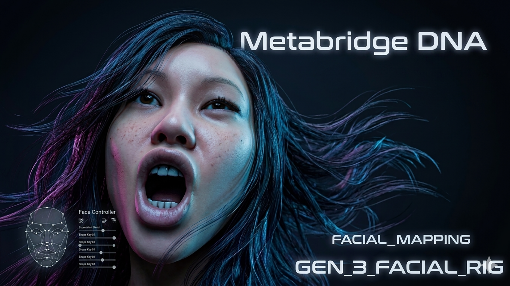
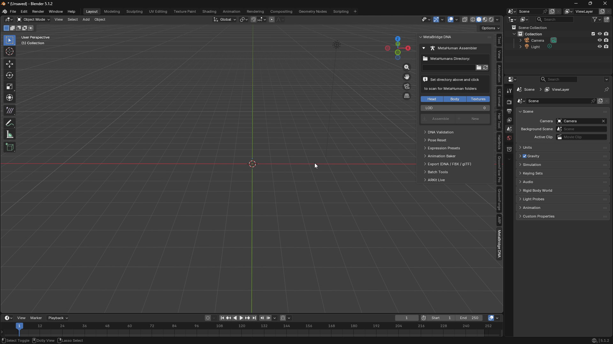
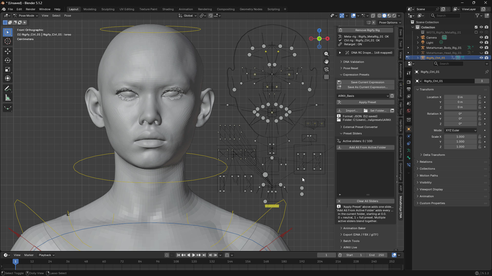

# MetaBridge DNA — User Guide

## What is this addon?

MetaBridge DNA lets you bring Epic Games **MetaHuman** characters into Blender, pose their faces in real time, and export them back out.

<iframe width="640" height="360" src="https://www.youtube.com/embed/rnNuLmuO7JE" title="Load MetaHuman DNA to Instant ARKit Controllers (No Shape Keys!)" frameborder="0" allow="accelerometer; autoplay; clipboard-write; encrypted-media; gyroscope; picture-in-picture; web-share" referrerpolicy="strict-origin-when-cross-origin" allowfullscreen></iframe>

With it you can:

- Load a MetaHuman character (head + body) into Blender
- Move sliders or bones to make facial expressions — no shape key editing needed
- Save your favorite expressions as reusable presets, and blend several at once
- Drive the face **live from an iPhone** using Apple's Live Link Face app
- Build an animatable body rig (Rigify) for the character
- Export everything back to DNA, FBX, or glTF

Everything is in one place: open the **N panel** on the right side of the 3D Viewport, and look for the **MetaBridge DNA** tab.

---

## 1. Loading a Character

This is the first thing you do — it's at the very top of the panel.

**Steps:**

1. Click the folder icon and pick the folder that contains your MetaHuman characters.
2. Click a character's thumbnail to select it.
3. Turn Head / Body / Textures on or off, depending on what you want to load.
4. Pick a **LOD** level (0 = highest quality, higher numbers = lighter/faster).
5. Click **Assemble**.

**Good to know:**

- You can load more than one character — click **New** to add another one as a separate slot.
- The list at the bottom shows every character currently in your scene. Click the radio button next to one to make it "active" (the one you're currently editing).
- The trash icon removes a character from the scene.
- If you want to load a *different* LOD later, change the LOD number and click **Re-Assemble**.
- There's no separate "load a single DNA file" option — Assemble is the only way in. Saving DNA files back out is done later, in the **Export** panel.

---

## 2. Making Facial Expressions (Face Rig)

**Steps:**

1. Click **Append GUIArmature** — this adds the control rig you'll use to make expressions.
2. Turn **Face Rig: ON**.
3. Select the GUIArmature in the viewport, go into **Pose Mode**, and move its bones. The face updates live as you move them.

**Good to know:**

- You're never editing shape keys directly — you're only moving control bones, and the character's face updates itself.
- If you don't see any reaction when moving a bone, double check Face Rig is switched ON.

---

## 3. Expression Presets (save & reuse expressions)

Instead of posing a face from scratch every time, save an expression once and reuse it — and mix several expressions together.

**Saving a preset:**

1. Pose the face the way you want it.
2. Click **Save As Current Expression...** and give it a name.
3. To update a preset you already saved, select it in the list and click **Save Current Expression**.

**Using a preset:**

1. Pick a preset from the dropdown.
2. Click **Apply Preset** — it's added to the **Preset Sliders** list below, already turned on.
3. Drag its slider between 0 (no expression) and 1 (full expression).

**Blending multiple expressions:**

- You can have many sliders active at once — they combine automatically. For example, a smile at 0.6 plus a raised eyebrow at 0.4, at the same time.
- **Add All From Active Folder** loads every preset in your current folder as a slider, all starting at 0 — handy for building a combined expression from scratch by dialing several up together.
- The **X** button removes one slider; **Clear All Sliders** resets everything back to neutral.
- Sliders are normal Blender properties, so you can keyframe and animate them like anything else.

**Good to know:**

- **Set Folder...** lets you choose where presets are saved/loaded from — useful if you keep different expression sets for different projects. This choice is remembered even after restarting Blender.
- **Import...** lets you bring in a preset file from anywhere on your computer.
- Presets made in Maya or Houdini can also be imported — see below.

**Converting presets from other programs:**

- **Convert & Import (Maya/Houdini)...**: brings in a saved pose from Maya or Houdini and matches its bone names automatically. If some names can't be matched, they're listed in a mapping file you can fill in by hand and re-import.
- **Convert ARKit Payload...**: a one-time setup step that generates the 52 `ARKit_...` presets used by ARKit Live (see below). You normally only need to run this once, when first setting up ARKit tracking for a character.

---

## 4. ARKit Live (real-time face tracking from your iPhone)

Stream your real facial expressions live from an iPhone straight onto the MetaHuman character, using Apple's free **Live Link Face** app.

**Setup:**

1. Make sure your iPhone and your computer are on the same Wi-Fi network.
2. In the Live Link Face app, make sure it's in its normal streaming mode (**not** "MetaHuman Animator" mode — that mode only records video for later processing in Unreal Engine and will never send anything live to Blender).
3. In the app, set the target IP address to your computer's address, and the port to **11111**.
4. In Blender's ARKit Live panel, leave **Host** as `0.0.0.0` and **Port** as `11111`, then click **Connect**.
5. Move your face — the character should follow along, and you'll see the **Preset Sliders** panel values change live.

**Tuning the feel of the tracking:**

| Setting | What it does |
|---|---|
| **Smoothing** | Makes movement smoother and less jittery. Higher = smoother but slightly slower to react. |
| **Deadzone** | Ignores small, noisy values so the face doesn't drift or twitch at rest. Raise this if the face looks slightly "off" even when you're not making any expression. |
| **Gain** | Boosts expressions that don't reach full strength — useful if opening your mouth all the way only makes the character open it a little. |

**Recording:**

- Click **Record** to save the live performance as keyframes on the timeline, starting from the current frame. Click **Stop Recording** when you're done.
- Or, if you already have a recording exported from the Live Link Face app as a CSV file, use **Load Live Link Face CSV...** to bake it in instead.

**Head Rotation (Experimental):**

- Turns on head turning/tilting/nodding, driven by the same iPhone data.
- Requires the body's **Rigify** rig to be set up first, with **Apply Retarget** and **Link Head Rig** both done (see the Rigify section below). The panel will tell you if this hasn't been done yet.
- If the head turns the wrong way on some axis, use the **Invert Pitch / Yaw / Roll** buttons to flip it.
- While a live head-rotation signal is coming in, you can't manually pose the head bone by hand — click **Disconnect** first if you need to.

**Troubleshooting:**

- **Nothing moves at all, even though slider values are changing:** check for a red **Apply error** message in the panel, and make sure the correct character is Activated.
- **The face looks slightly "off" even at rest** (eyes look a bit closed, mouth looks a bit open, etc.): this is usually the phone's tracking being a little uncalibrated for your face/lighting. Try the **Calibrate** feature inside the Live Link Face app first (hold a relaxed, neutral face and tap Calibrate), then fine-tune with Deadzone/Gain if needed.
- **A specific expression looks strange only when moved by itself, all the way to maximum:** many MetaHuman expressions are designed to look natural only when combined with other expressions, the way a real face would. This is expected — it's rarely an issue once you're driving the face live or blending several sliders together.

---

## 5. Rigify Body Control Rig

Turns the MetaHuman body into a fully animatable rig, so you can pose/animate the body the same way you would any Rigify character.

Requires the **Rigify** addon to be enabled first (`Edit > Preferences > Add-ons`, search for "Rigify").

**Steps, in order:**

1. **Build Meta-Rig** — creates a draft skeleton matching the body.
2. **Generate Rigify Rig** — turns the draft into a real, posable control rig.
3. **Apply Retarget** — connects the control rig so it actually drives the MetaHuman body.
   > ⚠️ If the draft skeleton from step 1 wasn't positioned correctly, this can distort the mesh. Check that everything looks right after step 2, before applying.
4. **Link Head Rig** — connects the head so it moves together with the body (e.g. when the body/neck turns, the head follows).
5. **Remove Rigify Rig** removes everything from steps 1-4 if you need to start over.

---

## 6. Exporting

One panel handles both saving DNA files and exporting to other formats.

- **DNA**: separate **Head** and **Body** buttons (there's no combined "Full" option, since head and body are always saved as two separate `.dna` files). Any edits you made in Blender are included.
- **FBX / glTF**: **Full / Head / Body** buttons. You can choose whether to include the control rig and animation in the export dialog.

**Batch Tools** (for handling many characters at once):

- **Assemble All Characters** — loads every character found in your folder in one go.
- **Export All Slots** — exports every loaded character at once.

---

## 7. Other Useful Tools

- **DNA RC Inspector**: shows how the control bones are connected to the character's underlying DNA data. Most people won't need to touch this — it's mainly for troubleshooting a specific control that isn't working.
- **DNA Validation**: checks whether a `.dna` file is valid/undamaged before you try to use it.
- **Pose Reset**: instantly resets the face back to neutral.
- **Animation Baker**: turns your live/keyframed facial performance into a permanent, exportable animation (useful before exporting to FBX/glTF, since some programs don't support the same live-driving setup Blender uses).

---

## Quick Tips

- **LOD 0** is always the highest quality — use it unless you need better performance.
- You can combine **live ARKit tracking** with **manual Preset Sliders** — if the live tracking doesn't get an expression quite right, just nudge the corresponding slider by hand afterward.
- If something that used to work suddenly doesn't move at all, it's often because **Face Rig** or the character's **Rig ON/OFF** got switched off by accident — check those first.
