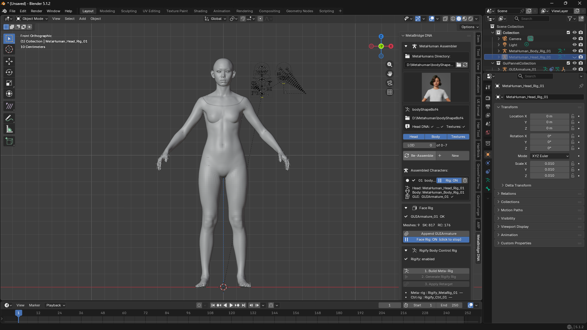
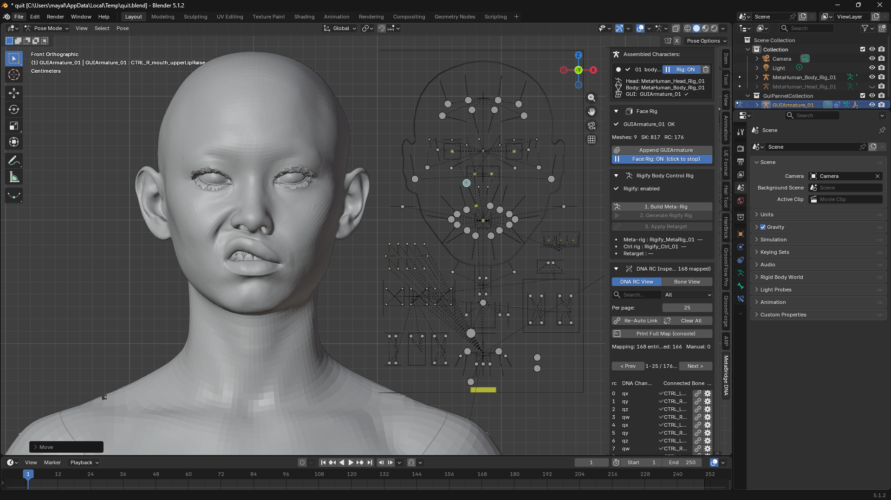
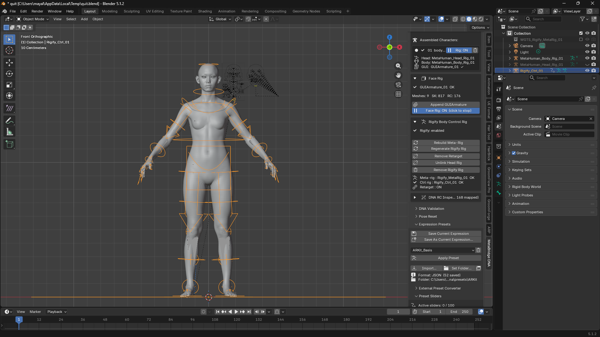
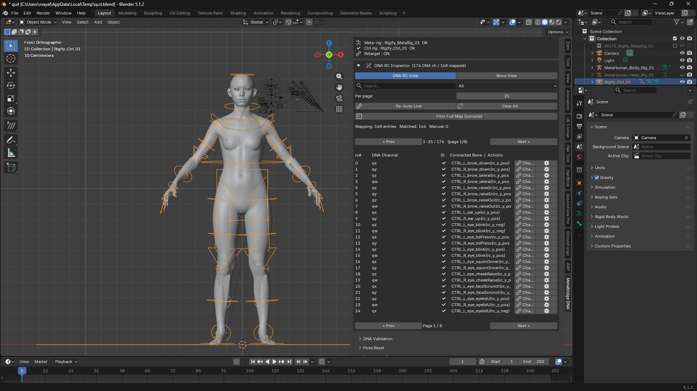
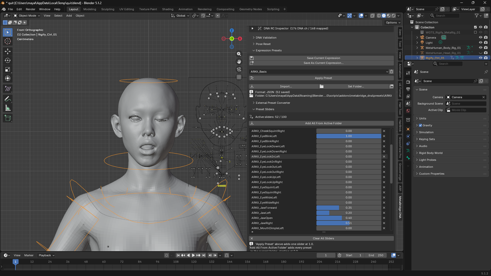

# MetaBridge DNA

## Overview

metabridge_dna is a Blender addon for importing and exporting Epic Games MetaHuman **DNA files** (`.dna`).

- **Import/export** MetaHuman DNA files in Blender (DNA / FBX / glTF)
- Manage Head and Body separately, then **assemble** them into one character
- A **Face Rig board** for driving facial expressions (real-time preview via bone controls)
- **Rigify integration** that auto-generates an FK/IK control rig on the body, extending it into an animatable rig
- Manage multiple characters as slots; state survives save/reload automatically

Everything lives in a single **MetaBridge DNA** tab in the 3D Viewport sidebar (`N` panel). (Character assembly is integrated as the top section of the main panel.)

---

## MetaBridge DNA Panel Layout

From top to bottom:

### 1. MetaHuman Assembler (character loading — topmost section)

| Item | Description |
|---|---|
| **MetaHumans Directory** | Path to the parent folder containing MetaHuman character folders. The refresh button next to it re-scans the folder. |
| **Character thumbnail browser** | Pick a scanned character by icon. Selecting one shows its name/path/Head·Body·Textures availability below. |
| **Head / Body / Textures toggles** | Choose which parts to include when loading. |
| **LOD slider** | Sets the LOD used for both mesh generation and RigLogic evaluation. (See the LOD section below.) |
| **Assemble / Re-Assemble** | Loads the selected character into the scene. Becomes "Re-Assemble" once the active slot is already assembled. |
| **New** | Adds the current character as a new slot, so multiple characters can exist in the scene at once. |
| **Assembled Characters list** | List of characters currently loaded into the scene. For each entry: |
| ↳ Radio button | Switches the active slot (the one being edited). Switching also syncs the directory/thumbnail/LOD above to that slot. |
| ↳ **Rig ON/OFF** | Toggles that character's real-time facial rig evaluation. |
| ↳ Trash icon | Removes that character from the scene. |

> There is no menu for loading individual DNA files - Assembling a character folder is the only load path. Saving (exporting) head/body DNA is handled in the **Export** section below.

 
 

### 2. Face Rig
- **Append GUIArmature**: Adds the GUI armature (the slider-bone rig used to drive expressions) to the scene. This is the core control rig for posing expressions.
- **Face Rig: ON/OFF**: Toggles whether GUI armature bone movement is applied to DNA blend shapes/joints in real time.

 
 

### 3. Rigify Body Control Rig
Requires the Rigify addon to be enabled (`Edit > Preferences > Add-ons > Rigging: Rigify`).

1. **1. Build Meta-Rig**: Generates a Rigify meta-rig (draft skeleton) matching the body skeleton. You can manually adjust bone positions after generation if needed.
2. **2. Generate Rigify Rig**: Generates the actual FK/IK control rig from the meta-rig.
3. **3. Apply Retarget**: Connects the generated control rig so it actually drives the MetaHuman body. (**Warning**: if the meta-rig is positioned incorrectly, the mesh can break — verify the rig is correctly placed after step 2 before applying.)
   - **Remove Retarget**: Disconnects it.
4. **Link Head Rig** (shown after Retarget is applied): Connects the head rig to the body control rig so both move as one rig.
   - **Unlink Head Rig**: Disconnects it.
5. **Remove Rigify Rig**: Removes all generated Rigify objects/constraints.

 
 

### 4. DNA RC Inspector
A tool for checking/editing how DNA raw control channels are connected to GUI bones.

- **View (DNA RC View / Bone View)**: Switch between browsing by DNA channel or by GUI bone.
- **Search box / Show filter (All / Mapped / Unmapped)**: Search by name, or filter to only connected / only unconnected entries.
- **Per page**: Number of rows shown per page.
- **Re-Auto Link**: Automatically reconnects channels to bones based on naming rules.
- **Clear All**: Clears all manually configured connections.
- **Print Full Map**: Prints the full mapping to the console.
- Each row: **Connect / Change Bone** (connect or change), the gear icon (bone detail popup), and **X** (disconnect a manual link) manage each channel individually.

 
 

---

## Extended Features (Sub-Panels)

Collapsible sub-panels below the main panel. Click the arrow to expand.

### DNA Validation — `dna_validate.py`
- **Validate DNA File...**: Checks a `.dna` file and reports corruption / signature errors / parse failures / RigLogic init failures separately, and prints joint/mesh/blend shape/LOD counts to the console.
- **Validate Active Slot**: Validates both the head and body DNA files of the active slot in one go.
- On a load failure, a specific reason is now shown instead of the generic "Invalid DNA file".

### Pose Reset — `reset_pose.py`
- **Reset All Controls**: Resets all facial controls of the active slot back to neutral (no expression).
- **Reset Selected (Pose Mode)**: In Pose Mode, resets only the selected control bones.

### Expression Presets — `pose_presets.py`
- **Storage format/location**: Presets are JSON files, one file per preset, saved in a folder.
  Format: `{"bones": {"<bone name>": [x, y, z]}}` — only non-zero control positions are recorded, keeping presets portable across characters.
- **Save Current Expression**: Overwrites the preset currently selected in the dropdown with the current expression. (Confirms before saving; disabled if no preset is selected.)
- **Save As Current Expression...**: Opens a file save dialog to save under a new file name. The save location is shown directly; the default location is the current preset folder.
- Select a preset from the dropdown, then **Apply Preset**: instead of snapping instantly, adds it as a slider to the **Preset Sliders** list below (starting at 1.0 so the expression shows immediately). The slider moves an existing GUI board control bone directly - it does not create a shape key.
- **Import...**: Pick a preset `.json` file from anywhere and copy it into the presets folder, adding it to the list. (Includes format validation.)
- **Set Folder...**: Choose the folder used to save/list presets. The chosen folder is saved in the addon config and persists across restarts; picking the addon's own default presets folder again resets it to default. The current folder is shown at the bottom of the panel.
- **Window icon button**: Opens the current presets folder in the file browser. Files dropped in directly are picked up automatically.
- Trash icon: deletes the selected preset.

#### Preset Sliders (blend multiple presets) — `preset_sliders.py` (sub-panel of Expression Presets, up to 100 entries)
- Every time **Apply Preset** is clicked, a row (preset name + a 0-1 slider) is added to this list (if the preset already has a row, its value is just reset to 1.0). The initial value is 1.0, so the expression shows immediately.
- **Add All From Active Folder**: Registers every preset in the currently selected presets folder as a slider in one go. These start at **0.0 (neutral)** — stacking dozens of presets at 1.0 simultaneously would produce a chaotic expression, so the intent is to register everything and then dial up only the ones you need. Presets already in the list are skipped.
- A slider's value directly interpolates GUI board control bone positions between **Basis (0, neutral) and the saved preset pose (1, fully applied)**. No new shape key is created - it only moves the control bones that already exist, by that proportion.
- Multiple sliders with a value above 0 at the same time blend additively per bone (e.g. a smile preset at 0.6 plus an eyebrow preset at 0.4, simultaneously).
- You don't need to worry about the control bones' physical travel limit (±0.01, corresponding to a raw control value of 1.0) - since the saved preset values already respect that range, a slider at 1.0 exactly reproduces the pose as it was saved.
- Each row's **X** button removes it individually; **Clear All Sliders** removes all of them and returns to the neutral pose.
- Each slider is a regular Blender property, so it can be **keyframed and animated**. A handler is registered to recompute the blend every frame during animation playback and timeline scrubbing too, so it behaves identically to interactive dragging.

 
 
#### External Preset Converter — `preset_convert.py` (sub-panel of Expression Presets)
- **Convert & Import (Maya/Houdini)...**: Imports a JSON preset saved from Maya/Houdini, converting its bone names.
  - Supported input formats: `{"bones": {...}}`, `{"controls": {...}}`, a flat dictionary `{"<name>": [x,y,z]}`, or `{"<name>": value}` (a single value is treated as the Y axis)
  - Automatic matching order: ① user mapping file → ② exact match → ③ case-insensitive → ④ normalized comparison (strips the `rig:` namespace / `|` DAG path prefix, removes special characters) → ⑤ unique suffix/substring match
  - **Value Scale** option: if the source values are in the -1..1 range, enter 0.01 to match the GUI board's travel amount.
- **Names that failed to match** are automatically recorded in `name_mapping.json` as `"<source name>": ""`. Use the **Edit Name Mapping** button to open the file, fill in the target bone names, and re-import - that mapping is then applied first.
- Detailed conversion results (matched/failed lists) are printed to the console.
- **Convert ARKit Payload...**: Reads an ARKit remap payload JSON (the `arkit52` target/weight list) and generates one GUI board pose preset per ARKit target (JawOpen, BrowDownLeft, etc.).
  - Reverse-looks-up source names like `ctrl_expressions_jawopen` against gui_mapping.json's `rc_names` to convert them into a bone + axis direction, and converts weights into board travel amounts (±0.01).
  - Tiny weights below **Min Weight** (default 0.05) are excluded. Generated/skipped/unmatched details are printed to the console.

### Animation Baker — `anim_baker.py`
- Keyframe the GUI board bones first, then run **Bake Face Animation** to evaluate the whole frame range and bake the result into keyframes on the head rig bones and shape keys.
- Options: frame range/step, bake bones, bake shape keys, auto-turn-off Face Rig after baking (so the timer doesn't overwrite the baked keys).
- **Clear Baked Animation**: Removes the baked action.

### Export (DNA / FBX / glTF) — `exporter.py`
DNA saving and FBX/glTF export are unified into one panel.

- **DNA (.dna)**: Only **Head / Body** buttons (no "Full" - head.dna and body.dna are always separate files by nature, so they can't be combined into one). Each button opens a file save dialog where you can set the location and file name directly, and vertex edits made in Blender are saved along with it.
- **FBX / glTF**: Each format has **Full / Head / Body** buttons to export everything together or head/body separately. The file save dialog's options let you toggle Head/Body, whether to include the GUI board (excluded by default), and whether to include animation. `_Head`/`_Body` is appended to the file name automatically.

### Batch Tools — `batch_ops.py`
- **Assemble All Characters**: Assembles every scanned character into its own slot in one go. (Options to skip already-assembled characters and to cap the maximum count.)
- **Export All Slots**: Batch-exports every assembled slot to a chosen folder as FBX/glTF.

---

## LOD — `lod_manager.py`
- **Location**: The **LOD** slider right below the Head/Body/Textures toggles in the MetaHuman Assembler section at the top of the main panel.
- **Applied on load**: When you Assemble the DNA, the **mesh** is built at the configured LOD and RigLogic is initialized at the same LOD. Per-slot LOD is automatically restored after saving and reopening the file.
- **Changing the mesh**: To switch an already-assembled character's mesh to a different LOD, change the LOD value and click **Re-Assemble**. A warning is shown if the slider value differs from the mesh's current LOD.
- **Immediate effect (evaluation only)**: Changing the slider value immediately switches the active slot's RigLogic evaluation LOD. Switching slots syncs the slider to that slot's LOD.
- LOD 0 = highest detail; higher numbers mean lower polygon count.
