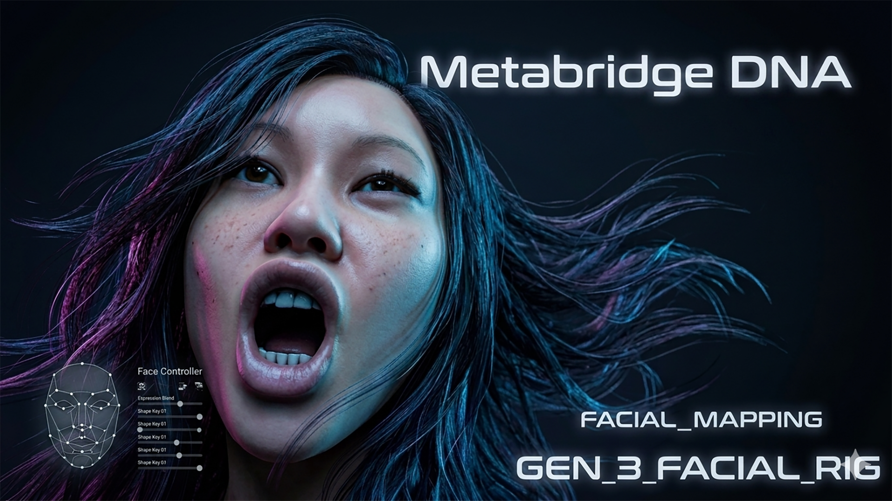
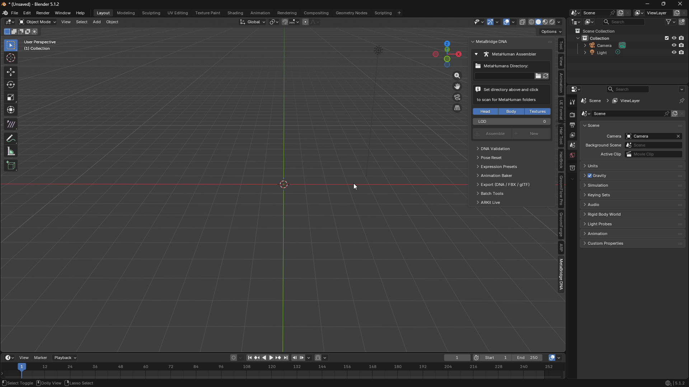
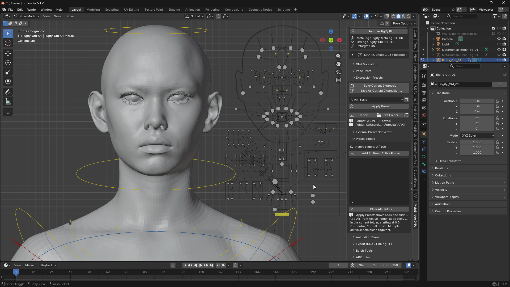
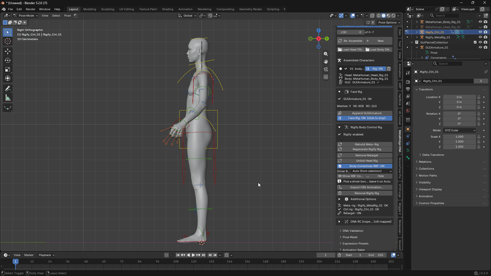
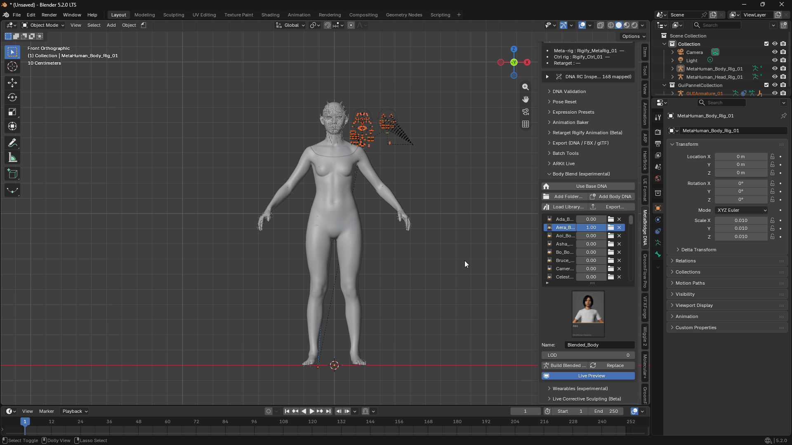
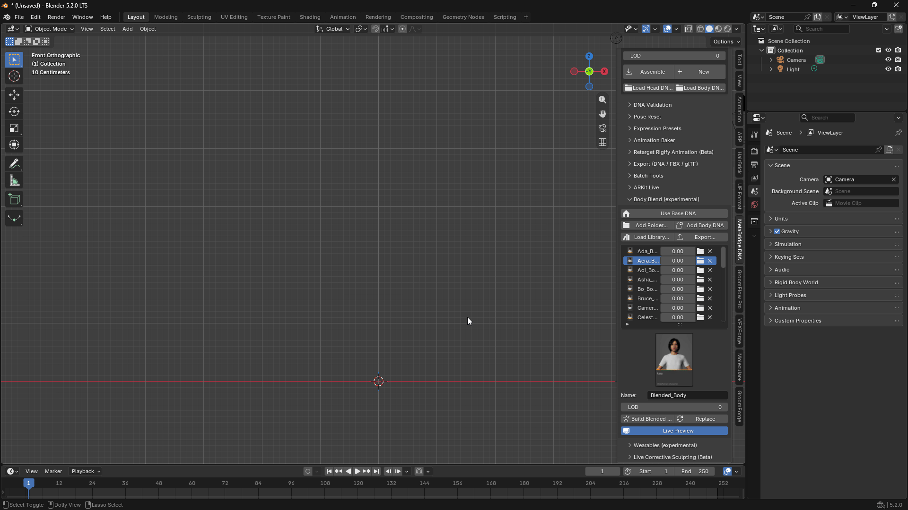
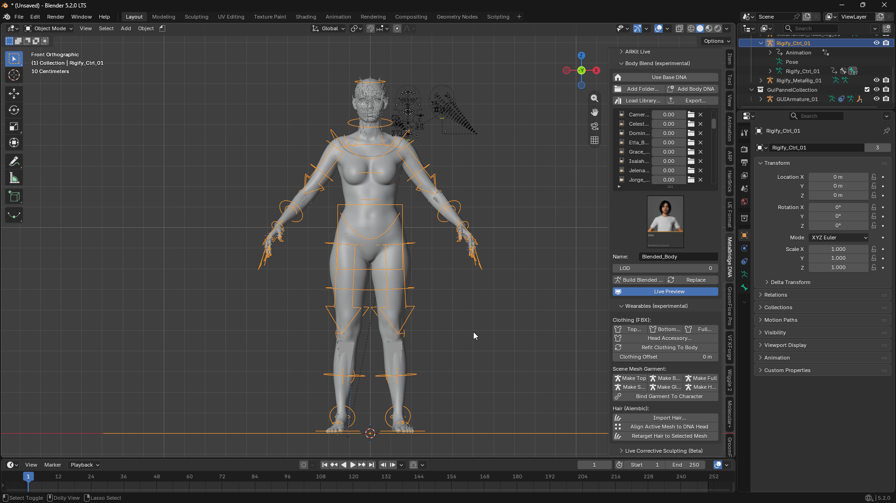
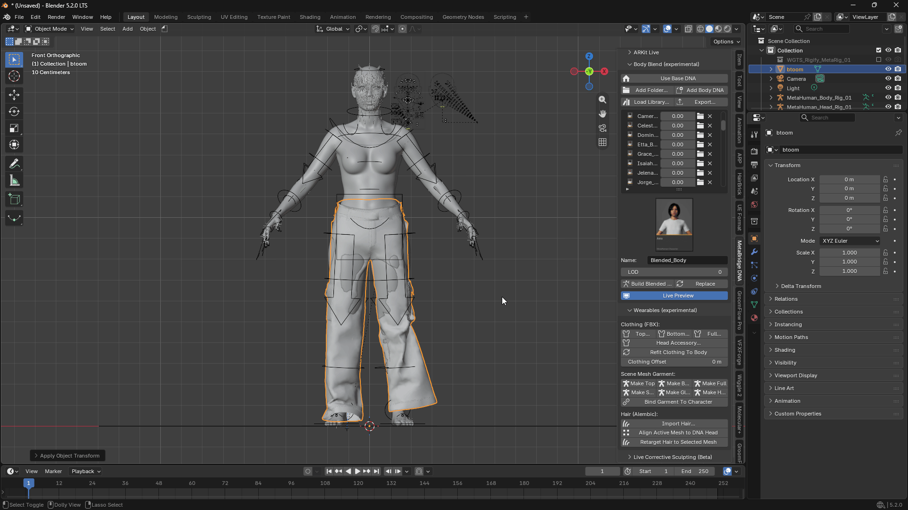
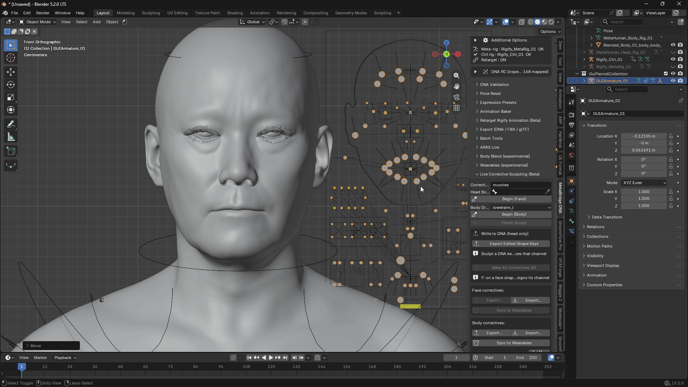

# MetaBridge DNA — User Guide

<div align="center">
  <iframe width="640" height="360" src="https://www.youtube.com/embed/4FGSyQCPH8Q" title="Blender metabridge_dna addon" frameborder="0" allow="accelerometer; autoplay; clipboard-write; encrypted-media; gyroscope; picture-in-picture; web-share" referrerpolicy="strict-origin-when-cross-origin" allowfullscreen></iframe>
</div>


## What's New

**v1.9.0 — Marvelous Designer round trip, send corrections to Unreal, spine rebuild, face correction fixes**

*MD Live (NEW)*

- **NEW: MD Live** — its own panel, next to MetaBridge DNA. Make clothes on this exact character in Marvelous Designer and bring them back already wearing. See [section 11](#11-md-live-marvelous-designer).
- **Send Body to MD** hands the character over as the avatar. Reshape the body, press it again, and the avatar is replaced — never doubled up.
- No import window on the Marvelous Designer side, and nothing to type in: the character simply appears.
- **Import Garment from MD** brings the finished clothes back at the right size, fitted to the character and following the rig immediately — the same as any other clothing.
- **Skip Stitches & Trims** leaves out the topstitch, button and zipper meshes, which carry most of a garment file's weight and none of what it needs to be worn.
- The panel shows the garment waiting to be imported and warns you when it is large enough to take a while.
- Sizes and the shared folder are remembered, so the setup is done once and never again.

*Write to DNA (NEW)*

- **NEW: Write to DNA** — a correction made on the head can now be written back into the character's `.dna` file and used in Unreal. Sculpted corrections are no longer Blender-only. See [section 8](#8-live-corrective-sculpting-beta).
- **NEW: Export Edited Shape Keys** — pick one of the character's own expressions, sculpt it directly, and send the fixed expression back to the `.dna`.
- **NEW: Bake All Correctives** — send every assigned correction in one click. Sending them one at a time used to keep only the last one.
- A sculpt that spreads beyond the area the original expression covered is now written in full instead of being trimmed at the edges.

*Live Corrective Sculpting*

- **NEW: Head Driver Bone** — a face correction can now be triggered by a head bone as well as by the expression controls. This is what fixes a custom head that breaks when the controls move.
- **NEW: Set Neutral** — teaches a correction where the character's rest position actually is, so it settles back to 0 instead of holding a leftover value.
- Face corrections now play back on their own. They previously worked only in Manual mode.
- Fixed a correction sculpted on a posed face being applied twice, making the expression too strong when sent to the `.dna`.
- Corrections no longer take a long pause on a full-resolution head.

*Sharing files with other people*

- **NEW: Relink DNA** — opening a `.blend` someone else saved used to leave the character sitting there doing nothing, with no explanation. The character now says which `.dna` file it can't find and gives you a button to point it at the file on your own machine.
- Your settings (the MetaHumans folder you last used, and so on) are now kept in one place per user instead of inside the addon folder. They survive updating the addon, they follow you between Blender versions, and they are never handed out with a copy of the addon.

*Rigify body rig*

- **NEW: Blender Rigify as a retarget source** — bring an animation from a rig made with Blender's own Rigify onto this character. This addon's rig has a six-segment spine where stock Rigify has four, so the two can't simply be copied across; picking **Blender Rigify** in **Source Type** maps them properly. Works whether that animation used IK or FK. See [section 5](#5-rigify-body-control-rig).
- **NEW: Finger IK** — pose a finger by dragging a target at its fingertip instead of rotating each joint one at a time. All ten fingers, on a rig that normally has no finger IK at all. Each finger has its own slider, so a hand can hold a prop with some fingers planted on it and the rest posed by hand, and a finger can ease into a contact instead of popping onto it. Off by default, in **Additional Options**.
- The spine now matches the MetaHuman skeleton, so the chest and spine controls turn the body from the right place instead of pushing it off to the side.
- Fixed the wrist bending when the torso is rotated.
- **NEW: Heel Pivot ON/OFF button** — rotating the foot control upward no longer pulls the foot away from the controller. Heel pivot is off by default and can be switched on when you want it.
- **IK Stretch** and **Heel Pivot** moved into a collapsible **Additional Options** section below **Remove Rigify Rig**, out of the way of the main build steps.

---

## What is this addon?

MetaBridge DNA lets you bring Epic Games **MetaHuman** characters into Blender, pose their faces in real time, and export them back out.

<div align="center"><iframe width="640" height="360" src="https://www.youtube.com/embed/rnNuLmuO7JE" title="Load MetaHuman DNA to Instant ARKit Controllers (No Shape Keys!)" frameborder="0" allow="accelerometer; autoplay; clipboard-write; encrypted-media; gyroscope; picture-in-picture; web-share" referrerpolicy="strict-origin-when-cross-origin" allowfullscreen></iframe></div>

With it you can:

- Load a MetaHuman character (head + body) into Blender
- Move sliders or bones to make facial expressions — no shape key editing needed
- Save your favorite expressions as reusable presets, and blend several at once
- Drive the face **live from an iPhone** using Apple's Live Link Face app
- Build an animatable body rig (Rigify) for the character
- Blend multiple bodies together, and dress the result in clothing and hair
- Export everything back to DNA, FBX, or glTF

Everything is in one place: open the **N panel** on the right side of the 3D Viewport, and look for the **MetaBridge DNA** tab.



---

## 1. Loading a Character

**Steps:**

1. Click the folder icon and pick the folder that contains your MetaHuman characters.
2. Click a character's thumbnail to select it.
3. Turn Head / Body / Textures on or off, depending on what you want to load.
4. Pick a **LOD** level (0 = highest quality, higher numbers = lighter/faster).
5. Click **Assemble**.



**Good to know:**

- You can load more than one character — click **New** to add another one as a separate slot.
- The list at the bottom shows every character currently in your scene. Click the radio button next to one to make it "active".
- The trash icon removes a character from the scene.
- If you want to load a different LOD later, change the LOD number and click **Re-Assemble**.
- Need to load one specific `.dna` file? Use the **Load Head DNA...** / **Load Body DNA...** buttons next to Assemble.
- **Material defaults**: if a `material_defaults.json` file is present in the addon folder, its BSDF values are applied automatically to newly created materials on every Assemble. Existing (already-created) materials are never overwritten, so your edits are preserved across Re-Assembles.
- All meshes are automatically set to **Smooth Shading** on Assemble.

---

## 2. Making Facial Expressions (Face Rig)

**Steps:**

1. Click **Append GUIArmature** — this adds the control rig you'll use to make expressions.
2. Turn **Face Rig: ON**.
3. Select the GUIArmature in the viewport, go into **Pose Mode**, and move its bones. The face updates live as you move them.


**Good to know:**

- You're never editing shape keys directly — you're only moving control bones.
- If you don't see any reaction when moving a bone, double check Face Rig is switched ON.

---

## 3. Expression Presets (save & reuse expressions)

Instead of posing a face from scratch every time, save an expression once and reuse it — and mix several expressions together.

**Saving a preset:**

1. Pose the face the way you want it.
2. Click **Save As Current Expression...** and give it a name.
3. To update a preset you already saved, select it in the list and click **Save Current Expression**.

**Using a preset:**

1. Pick a preset from the dropdown.
2. Click **Apply Preset** — it appears in the **Active Sliders** list just below, already turned on.
3. Drag its slider between 0 (no expression) and 1 (full expression).

**Blending multiple expressions:**

- You can have many sliders active at once — they combine automatically.
- **Add All From Active Folder** loads every preset in your current folder as a slider, all starting at 0.
- The **X** button removes one slider; **Clear All Sliders** resets everything back to neutral.
- Sliders are normal Blender properties, so you can keyframe and animate them.



**Good to know:**

- **Set Folder...** lets you choose where presets are saved/loaded from.
- **Import...** lets you bring in a preset file from anywhere on your computer.

**Converting presets from other programs:**

- **Convert & Import (Maya/Houdini)...**: brings in a saved pose from Maya or Houdini and matches its bone names automatically.
- **Convert ARKit Payload...**: a one-time setup step that generates the 52 `ARKit_...` presets used by ARKit Live.

---

## 4. ARKit Live (real-time face tracking from your iPhone)

Stream your real facial expressions live from an iPhone straight onto the MetaHuman character, using Apple's free **Live Link Face** app.

**Setup:**

1. Make sure your iPhone and your computer are on the same Wi-Fi network.
2. In the Live Link Face app, use normal streaming mode (**not** "MetaHuman Animator" mode).
3. In the app, set the target IP address to your computer's address, and the port to **11111**.
4. In Blender's ARKit Live panel, leave **Host** as `0.0.0.0` and **Port** as `11111`, then click **Connect**.


**Tuning the feel of the tracking:**

| Setting | What it does |
|---|---|
| **Smoothing** | Makes movement smoother and less jittery. Higher = smoother but slightly slower to react. |
| **Deadzone** | Ignores small, noisy values so the face doesn't drift or twitch at rest. |
| **Gain** | Boosts expressions that don't reach full strength. |

**Recording:**

- Click **Record** to save the live performance as keyframes on the timeline. Click **Stop Recording** when done.
- Or use **Load Live Link Face CSV...** to bake in a pre-recorded CSV file.

**Head Rotation (Experimental):**

- Requires the body's **Rigify** rig to be set up first, with **Apply Retarget** and **Link Head Rig** both done.
- If the head turns the wrong way on some axis, use the **Invert Pitch / Yaw / Roll** buttons.

**Troubleshooting:**

- **Nothing moves at all**: check for a red **Apply error** message and make sure the correct character is Activated.
- **Face looks slightly off at rest**: use the **Calibrate** feature in the Live Link Face app first, then fine-tune with Deadzone/Gain.

---

## 5. Rigify Body Control Rig

Turns the MetaHuman body into a fully animatable rig using Rigify.

Requires the **Rigify** addon to be enabled first (`Edit > Preferences > Add-ons`, search for "Rigify").

**Steps, in order:**

1. **Build Meta-Rig** — creates a draft skeleton matching the body.
2. **Generate Rigify Rig** — turns the draft into a real, posable control rig.
3. **Apply Retarget** — connects the control rig so it drives the MetaHuman body. Body correctives are registered at this step.
   > ⚠️ If the draft skeleton from step 1 wasn't positioned correctly, this can distort the mesh. Check that everything looks right after step 2, before applying.
4. **Link Head Rig** — connects the head so it moves with the body.
5. **Remove Rigify Rig** removes everything from steps 1–4 if you need to start over.

**Additional Options**


A collapsed section below **Remove Rigify Rig**, holding two switches you rarely need to touch:

- **IK Stretch ON/OFF** — off by default, so limbs stay rigid. Turn it on if you want the arms and legs to stretch when you pull the IK controls past full reach.
- **Heel Pivot ON/OFF** — off by default. On, rotating the foot spin control pivots the foot around the heel; this also makes the foot drift away from its controller as you rotate it upward, so leave it off unless you specifically want heel pivoting.
- **Finger IK ON/OFF** — off by default. See below.

**Finger IK**

Normally each finger joint has to be rotated one at a time. With Finger IK on, each finger gets a target at its fingertip — drag the target and the whole finger follows. Much faster for gripping a prop, planting a hand on a surface, or shaping a pose.

Rigify has no finger IK of its own, so this is added by this addon. All ten fingers are covered, thumbs included.

1. Turn on **Finger IK** in **Additional Options**. Ten small box controls appear at the fingertips.
2. In **Pose Mode**, drag a fingertip control. That finger bends to reach it, and no other finger moves.
3. Turn it off to go back to rotating the joints by hand.

**Per-finger sliders**

Under the button there is a slider for each of the ten fingers: **0** poses that finger by rotating its joints, **1** makes it follow its fingertip target. The ON/OFF button just sets all ten at once.

This is what makes the feature useful for real hand animation:

- **Holding a prop** — put the fingers touching the object on 1 so they stay planted while the wrist moves, and leave the fingers in the air on 0 where hand-posed arcs look better. The thumb usually wants its own setting.
- **Easing into a contact** — a value in between blends the two. Keyframe a finger from 0 to 1 over a few frames as the hand lands on a surface and it settles into place instead of popping.
- **Backing off one bad finger** — if one finger bends oddly, drop just that slider instead of turning the whole hand back to FK.

**Switching without losing the pose — IK to FK / FK to IK**

The two sliders hold two separate poses, so moving a slider swaps between them rather than carrying one across. These two buttons carry it across:

- **IK to FK** — keeps the pose you built with the fingertip targets, hands it to the joint controls, and switches all ten fingers to 0. The fingers do not move. Use this once you're happy with an IK pose and want to keep refining it joint by joint, or before keyframing in FK.
- **FK to IK** — keeps the pose you built by hand, moves the fingertip targets onto it, and switches all ten fingers to 1. Again nothing moves. Use this when a hand you posed by hand now needs to hold onto something.

Both work on all ten fingers at once, and both are safe to press repeatedly.

**Good to know:**

- Switching it on keeps the fingers exactly where they already were — nothing jumps.
- Switching it off leaves the pose exactly as it was too, so you can move back and forth freely.
- The fingertip targets follow the hand, so posing the arm keeps the finger pose intact.
- **Snap Fingertip Targets to Pose** moves all ten targets onto wherever the fingers are right now, without changing the pose. You need it when a slider sits between 0 and 1 — the finger is then somewhere between its two results and no longer touching its target — or after loading an animation.
- Lowering a slider by hand does **not** keep the IK pose. The joint controls still hold whatever they held before, so the finger springs back to that. Use **IK to FK** instead — see below.
- There is no elbow-style direction control for fingers, so the solver picks which way a finger bends. It follows the joints sensibly for normal poses, but pulling a target far sideways can twist the finger oddly. Lower that finger's slider if it does.
- With Finger IK off, the rig behaves exactly like stock Rigify — the finger master curl and the individual joint controls work as usual.


**Body Correctives — automatic muscle & twist detail**

Once Apply Retarget is done, the body rig automatically adds secondary deformation (shoulder blade, muscle bulge, limb twist) using data built into the character's DNA. No setup needed.

- **Body Correctives RBF: ON/OFF** — toggles the RBF solver layer. Leave it **ON** for the most realistic result. Basic twist/muscle correction stays active either way.
- If a character's DNA doesn't include this data, the button shows **"none in this DNA"** and is grayed out.

**Fine-tuning by hand (RBF Controllers)**

For spots that need a manual touch-up beyond the automatic result:

1. Pick the joint you want from the **Driver Bone** list, or leave it on **Auto** and select a control in **Pose Mode** (e.g. `shoulder.L`).
2. Click **Show RBF Controls** — small diamond-shaped helper bones appear for that area.

> Use the **Driver Bone** list for the knee. Its correctives belong to `calf_l` / `calf_r`, and while a leg is on IK there is no control you can select that points at those, so **Auto** finds nothing there.
3. Adjust the **influence slider** (0–1) per bone in the **Active RBF Controllers** list:
   - `0` = automatic corrective **off** (bone stays at rest/neutral)
   - `1` = automatic corrective **fully applied** (default)
4. **Rotate** a helper bone by hand to add an extra manual correction on top of the automatic result.
5. Click **Hide** when done to tidy the viewport.

> Rotating a helper bone at `influence = 1` stacks your manual rotation on top of the full automatic result. At `influence = 0` only your manual rotation is used.

**Import FBX Animation (Beta)**

Apply a MetaHuman animation exported from Unreal (FBX) straight onto this character — body and head animate together, automatically, even if the character's proportions don't exactly match the source animation.

1. Click **Import FBX Animation...** and pick the `.fbx` file.
2. Both the body and head are keyframed with the retargeted animation.

The button is greyed out while the control rig is connected to this character, because the rig would overwrite the imported animation every frame. Click **Remove Retarget** (and **Unlink Head Rig**) above, then import. Hover the greyed-out button to see this reminder.

**Retarget Rigify Animation (Beta)**

Copy an animation from another already-animated character onto this character's control rig. Use this when the animation lives on a rig rather than in an FBX file.

1. Open the **Retarget Rigify Animation (Beta)** panel.
2. **Source Rig** — the animated armature to copy from.
3. **Source Type** — which kind of rig that is:

   | Source Type | Use it for |
   |---|---|
   | **UE5 Mannequin** | Unreal's own mannequin |
   | **Fortnite** | Fortnite characters (same bone names as UE5) |
   | **MetaHuman** | another MetaHuman (same bone names as UE5) |
   | **Mixamo** | anything downloaded from Mixamo |
   | **Blender Rigify** | a rig made with Blender's own Rigify |

4. **Target Rig** — this character's Rigify control rig.
5. Click **Retarget**.

The animation is baked onto the target's controls, corrected for the two characters having different proportions and different rest poses.

**About Blender Rigify as a source:**

This addon's rig is *not* identical to a stock Rigify rig — its spine has six segments where Blender's has four — so an animation cannot simply be copied across. Picking **Blender Rigify** maps the two properly.

It works whether that animation was made with **IK or FK** arms and legs. You do not need to convert or bake the source rig first.

**Good to know:**

- Once Apply Retarget and Link Head Rig are set up, the connection is saved with your file — reopening it works without re-clicking Apply Retarget.
- The Rigify shoulder bone (`shoulder.L/R`) must be manually elevated when raising the arm. Key the shoulder bone alongside the arm for the most natural shoulder deformation.

---

## 6. Body Blend (experimental)


Combine two or more MetaHuman body types — and their matching heads — into a brand-new blended character. Found in its own **Body Blend (experimental)** panel, collapsed by default.

**Adding sources:**
- **Use Base DNA** — adds the addon's own reference character from the `base_dna/` folder.
- **Add Folder...** — adds every character in a folder at once. **This is how you build a library.** See below.
- **Add Body DNA** — add one specific `.dna` file by hand.
- **Load Library...** — load a compact archetype library and add every archetype in it as a source.

**Add Folder... — building a library**

Point this at a folder holding **the original `.dna` files of several characters**, with each character's head and body sitting side by side:

```
MyBodies\
   Boy01_body.dna    Boy01_head.dna
   Boy02_body.dna    Boy02_head.dna
   Boy03_body.dna    Boy03_head.dna
   ...
```

Every character in that folder is added in one click, and each body is paired with its own head automatically. That folder is now your library — collect the characters you blend with into one place and you can load them all whenever you start a new blend.

**Important:**

- Both files must be in the **same folder**, named so they match (`Name_body.dna` and `Name_head.dna`). A body with no matching head is still added, but it can only contribute a body shape.
- Only the folder you pick is read — characters in **sub-folders are not** included. Point it at the folder that directly holds the `.dna` files.
- The addon's own `base_dna/` folder holds a single reference character, so picking it adds only that one. That is expected — use **Use Base DNA** for it instead.

Weights don't need to add up to anything in particular — they're normalized automatically. **Use Base DNA** starts at `1.0`; all other sources start at `0.0`.

**The primary row:**

The **highlighted row** is the primary source — it supplies the topology, skin weights and face rig. Every other row just contributes its shape. If you only add library entries (no real `.dna` row), the addon quietly uses its own reference character as the primary behind the scenes, so you can build purely from a library.

**Building:**

1. Add and weight your sources.
2. Click a row to make it the primary.
3. Pick a **LOD** level.
4. Give it a **Name**.
5. Click **Build Blended Body**.

**Replace:**

Turn on **Replace** to overwrite your last Body Blend character in place instead of adding a new slot every time.

**Live Preview:**

After a Build, dragging any weight slider re-blends and updates the character already on screen. Turn Live Preview off if it slows things down.

**Good to know:**

- The head only blends if every weighted row has head data. If one is missing, the body still blends but the head is skipped and a note explains why.
- **Textures**: after building, the addon looks for a `Maps` folder next to the primary DNA, then falls back to `base_dna/Maps`.
- Shape keys on the blended head are copied from the primary head source only.
- Posing/expressions work normally on a blended character, and stay correct even after you go back and adjust the weight sliders.

**The `base_dna/` folder:**

Put your own reference `Body.dna` and matching `Head.dna` here (`metabridge_dna/base_dna/`). This is what **Use Base DNA** adds, and what Build falls back to when nothing else is weighted.

**Compact archetype libraries:**

- **The bundled library ships 39 archetypes**: the 29 standard MetaHuman body types plus **10 custom child bodies**, each with matching head data — blend child body types in directly for smaller/younger proportions.
- **Export...** — packs exactly the sources currently listed in the panel into one compact `.json` library. If the list is empty, it instead scans a folder you pick (including subfolders).
- **Load Library...** — loads a library, one row per archetype, replacing any previously loaded library rows (your own `.dna` rows stay). You don't need to keep the original `.dna` files around once you have a library.

---

## 7. Wearables (experimental)

**Beta** — weights can still look off during animation/posing in some cases. Being actively improved; touch up in Weight Paint mode if needed.

Attach clothing (FBX) and hair/grooms (Alembic `.abc`) to the *active* character — found in its own **Wearables (experimental)** panel, collapsed by default. Works on any assembled or Body-Blend-built character.

There are two ways to dress a character: import a **clothing FBX** built for a MetaHuman skeleton, or **rig any mesh already in your scene** yourself. Both end up following the character the same way afterward.

**Clothing (FBX):**

- **Top... / Bottom... / Full...** — import a MetaHuman-compatible clothing `.fbx` and attach it to the body, tagged with that category.
- **Head Accessory...** — same idea, for things that attach to the head instead (glasses, earrings, ...).
- **Retarget To Body Proportions** (on by default): fits the garment to this character's own proportions instead of the body it was originally made for — without going skin-tight, so a loose shirt stays loose.
- Clothing automatically avoids clipping into the character's skin.
- **Clothing Offset** slider — floats all worn clothing slightly off the skin, if you want extra breathing room. Updates live.
- **Categories replace what they conflict with**: a new Top clears any worn Top/Full; a new Bottom clears Bottom/Full; a new Full clears both. Head accessories never auto-remove anything.
- **LOD0 only**: if the FBX bundles multiple LODs, only LOD0 is kept.

**Scene Mesh Garment (Make + Bind):**

For a mesh already in your scene that doesn't have a MetaHuman skeleton of its own.

1. Select the garment mesh and click **Make Top / Bottom / Full / Shoes / Gloves / Head Acc** — this fits it to the character and rigs it to move with the character's skeleton. Works best on a garment already modeled to roughly fit the character.
2. Click **Bind Garment To Character** — attaches it to the active character, exactly like an imported clothing FBX from here on (category replacement, Body Blend live follow, Refit, Clothing Offset all apply).

If deformation looks off in an extreme pose at a tight spot (armpits, between the thighs), touch it up in Weight Paint mode — everything else is unaffected.

**Hair (Alembic):**

- **Import Hair...** — imports a `.abc` groom and parents it to the head. Defaults are tuned for MetaHuman groom exports (**Scale 0.01**, **Rotation X -90°, Z -180°**) — adjust in the operator panel (bottom-left after import) if your source is different.
- **Bind To Head Surface** (on by default) — hair follows the head as it deforms, including through Body Blend changes, without collapsing onto the scalp.

**Good to know:**

- Clothing FBX placement depends on the file sharing bone names with a MetaHuman skeleton.
- Imported/rigged wearables aren't tracked as part of the character slot the way body/head meshes are — rename, move, or export them like any other Blender object.

---

## 8. Live Corrective Sculpting (Beta)

**Beta** — a correction sculpted with only one pose holds steady if you pose further than that; sculpt more than one pose for the same correction if you want it to keep changing shape further into the pose. Head corrections can be written back into the character's `.dna` and used in Unreal — see **Sending a correction to Unreal** below. Body corrections stay inside Blender.

Pose the character, then sculpt directly on top of that pose — the sculpt becomes a correction that fades in and out automatically from then on, every time the character moves toward and away from that pose. No keyframing needed. Works on both the face and the body, and automatically carries over to any clothing worn on the character.

**Steps:**

1. Open the **Live Corrective Sculpting (Beta)** panel.
2. Pose the character the way you want to fix or add detail to (a bent elbow, a stretched shoulder, an expression...).
3. Type a name for the correction in the **Corrective** field.
4. For a body correction, also pick which bone should trigger it from the **Body Driver Bone** list.
5. For a face correction, you can also pick a **Head Driver Bone**. Do this when the character has a custom head that breaks as the controls move — the correction then follows that bone as well as the expression.
6. Click **Begin (Face)** or **Begin (Body)** — this enters Sculpt Mode on a fresh shape key, already at full strength.
7. Sculpt the correction.
8. Click **Finish Sculpt**.

**If a correction doesn't fade all the way out:**

Return the character to its rest position and click **Set Neutral** on that correction. It then reads 0 at rest. A custom head often needs this.

**Editing an existing correction:**

Click the sculpt icon next to a correction's slider to re-enter Sculpt Mode on it directly and refine it further. Pose the character close to where it was originally sculpted first, for the most accurate result — this doesn't return the character to that pose for you automatically.

**Manual mode:**

Click the tool icon next to a correction to switch it to **Manual** — its slider can then be dragged by hand instead of following the pose. Useful for previewing a correction at any strength, or hand-animating it. Click it again to go back to automatic.

**Clothing:**

A correction sculpted on the skin automatically carries over to any clothing worn on that character. This happens on its own whenever you finish a sculpt or import one — click **Sync to Wearables** if you add new clothing afterward and want it to catch up. Each garment gets its own copy of the correction, with the same Manual/slider/edit controls as the skin's, listed right underneath it.

**Sharing corrections:**

- **Export...** saves every correction on a character to a `.json` file.
- **Import...** brings corrections from a file onto another character. It only works if that character has the same body/head as the one the file was exported from (built by this addon at the same LOD) — importing onto a mismatched character is rejected rather than corrupting the mesh.

**Sending a correction to Unreal (head only):**

Use the **Write to DNA (head only)** box. It writes a new `.dna` file and leaves the original untouched. There is no equivalent for the body — a MetaHuman body has no expression shapes to write into, so body corrections stay in Blender.

There are two ways to do it.

### Fixing an expression that breaks — Export Edited Shape Keys

This is the one to use when a face folds, spikes or collapses on a particular expression. You fix the character's own expression by hand and send that fix back into the `.dna`.

1. **Make the expression with the face controls.** Move the controls until the problem is on screen — for example open the jaw until the mesh breaks.

2. **Find the shape key that expression is using.** With the head mesh selected, look at its shape key list: the ones the controls are driving are the ones whose **value is above 0**. Opening the jaw, for instance, puts a jaw shape key at **1.0**. That is the one to fix.

   > Leave the face controls where they are. The shape key you are about to sculpt is only showing its shape because the controls are holding it there.

3. **Sculpt it.** With that shape key active, enter **Sculpt Mode** and shape the face the way it should look. You are editing the character's own expression, not adding a new one.

4. **Check it with the controls.** Leave Sculpt Mode and move the face controls through the expression again. The fix should follow the controls in and out. Keep sculpting until it does.

5. **Click Export Edited Shape Keys** and save. Every expression you changed goes into the new `.dna`; the ones you didn't touch are left exactly as they were.

**Good to know:**

- You can fix several expressions in one session — pose, sculpt, pose the next, sculpt — and one click sends them all.
- The button refuses to export if you haven't actually changed any of the character's expressions, so it never writes an empty file.
- With more than one character loaded, the **active character** is the one exported — the one with the filled dot next to it in **Assembled Characters**.

### Sending your own corrections

Click the ⇱ button on a correction and choose which expression it should ride along with. **Bake All Correctives** then writes every assigned correction at once. Always use this rather than sending them one at a time.

**In Unreal:** bring the new `.dna` in with **MetaHuman Creator ▸ From DNA**, and choose **Replace** with **Import Whole Rig** turned on. **Mesh Fit** rebuilds the expressions from scratch and will discard your edits.

---

## 9. Exporting

- **DNA**: separate **Head** and **Body** buttons (head and body are always two separate `.dna` files). To send a sculpted correction into the head `.dna` instead, use **Write to DNA** in [section 8](#8-live-corrective-sculpting-beta).
- **FBX / glTF**: **Full / Head / Body** buttons. Choose whether to include the control rig and animation in the export dialog.

**Batch Tools:**

- **Assemble All Characters** — loads every character found in your folder in one go.
- **Export All Slots** — exports every loaded character at once.

---

## 10. Opening a File Someone Else Saved

A `.blend` remembers where each character's `.dna` files were on the computer that saved it. On your machine those files are somewhere else, so the character appears but nothing about it responds.

You'll see this in **MetaHuman Assembler ▸ Assembled Characters** — the character is marked with a warning instead of a checkmark, and shows the file it's looking for:

> ⚠ Head DNA not found:
> `D:\SomeoneElse\MetaHumans\Bob\head.dna`
> **Relink Head DNA...**

Click **Relink Head DNA...** (or **Relink Body DNA...**) and pick the same file on your own machine. The character comes back to life immediately, and the warning disappears. Save the file afterwards so you only do this once.

If you pick the wrong file, nothing is broken — it's refused and the character stays as it was.

**To avoid this when sending a file to someone**, send the `.dna` files along with the `.blend`. They still need to relink once, but they'll have the files to point at.

---

## 11. MD Live (Marvelous Designer)

Make clothes on *this* character in Marvelous Designer, and bring them back already wearing.

MD Live is its own panel in the sidebar, next to **MetaBridge DNA**.

**Set up once**

1. Pick a **Shared Folder** — any empty folder both programs can reach.
2. Click **Open MD Plug-in Folder**.
3. In Marvelous Designer: **Plug-in ▸ Plug-in Manager ▸ Add**, and choose that folder. Two new entries appear in the Plug-in menu.

The folder and every setting are remembered, so this is a one-time step.

**Sending the character**

1. Click **Send Body to MD**.
2. In Marvelous Designer, click the MetaBridge avatar entry in the **Plug-in** menu.

The character appears as the avatar. No import window, no settings to fill in. Change the body in Blender, press **Send Body to MD** again, click the same menu entry again — the avatar is replaced, and you never end up with two.

Turn on **Include Head** if you're making hats or collars.

**Bringing the clothes back**

1. In Marvelous Designer, click the MetaBridge garment entry in the **Plug-in** menu.
2. In Blender, click **Import Garment from MD**.

The garment arrives at the right size, is fitted to the character, and follows the rig straight away — the same as any other clothing in [section 7](#7-wearables-experimental). Pick the **Category** so it replaces what it should.

**Skip Stitches & Trims** (on by default) leaves out the topstitch, button and zipper meshes. They carry most of the file's weight and none of it is needed to wear the garment.

**Good to know**

- The panel shows the garment waiting to be imported and how big it is. Above 100 MB it warns you — hide the trims in Marvelous Designer before exporting and the file shrinks a lot.
- **Send Scale** and **Import Scale** are already correct. Only touch them if what arrives is obviously the wrong size; Blender tells you the size it imported in the status bar.
- Marvelous Designer's own **Auto Fit** expects avatars from its library. **Prepare for Auto-Fit** (on by default) asks it to treat this character the same way.

---

## 12. Other Useful Tools

- **DNA RC Inspector**: shows how the control bones are connected to the character's DNA data. Mainly for troubleshooting a specific control.
- **DNA Validation**: checks whether a `.dna` file is valid before you use it.
- **Pose Reset**: instantly resets the face back to neutral.
- **Animation Baker**: turns your live/keyframed facial performance into a permanent, exportable animation.

---

## Quick Tips

- **LOD 0** is always the highest quality — use it unless you need better performance.
- You can combine **live ARKit tracking** with **manual Preset Sliders** — nudge sliders by hand if the tracking doesn't quite nail an expression.
- If something that used to work suddenly doesn't move, check that **Face Rig** or the character's **Rig ON/OFF** isn't accidentally switched off.
- For the most realistic shoulder deformation when raising the arm, key both the arm control and the `shoulder.L/R` bone together.

## Release Update Notes

**v1.7.1 — Rigify leg/foot polish**

*Rigify body rig*

- Legs and arms no longer stretch when moving the IK foot/hand controls.
- The toe control no longer drifts or bends the foot oddly when moving or rotating the foot control.
- **NEW**: rotating the foot spin control backward now lifts the toe naturally, pivoting from the heel.
- **NEW: IK Stretch ON/OFF button**, next to Generate Rigify Rig — switch limb stretching back on any time you want it, or leave it off (the new default) for rigid, non-stretchy limbs.
- Fixed the knee not straightening fully when the foot had heel-roll applied and the foot control was pulled out.
- Fixed the fingertip and toe bones (and their controllers) being generated bent 90° when building the meta-rig.
- **NEW**: once a leg is fully extended, pulling the foot control further automatically rolls the heel up (foot goes on tiptoe), and pulling further still un-curls the toes onto their tips — both add on top of manual foot-roll/toe control.

**v1.7.0 — Live Corrective Sculpting**

*Live Corrective Sculpting (NEW)*

- **NEW: Live Corrective Sculpting panel** — pose the character, then sculpt directly on top of that pose to add or fix a shape correction (a muscle bulge on a bent arm, a wrinkle at a joint...). It plays back automatically from then on, every time the pose repeats. Works on both the face and the body. See [section 8](#8-live-corrective-sculpting-beta).
- A correction sculpted on the skin automatically carries over to any clothing worn on the character, so a sleeve bulges along with the arm underneath it.
- Any correction can be switched to **Manual** and adjusted by hand with a slider instead of following the pose.
- **Export / Import** saves a sculpted correction to a file so it can be shared with another character or another user with the same body/head.

**v1.6.0 — Wearables, Body Blend improvements, Rigify body rig polish**

*Wearables (NEW)*

- **NEW: Wearables panel** — dress a character in clothing (FBX) and hair (Alembic `.abc`). See [section 7](#7-wearables-experimental).
- Clothing now fits properly at the collar, doesn't tear or balloon, and adapts to the character's real body shape instead of just its skeleton.
- A **Clothing Offset** slider lets you float clothing slightly off the skin if it's clipping.
- **NEW: rig any mesh in your scene as clothing** (Make + Bind) — no MetaHuman-compatible FBX needed. Includes shoes, gloves, and head accessories.
- Hair now keeps its imported shape and follows the head correctly, including through Body Blend changes.

*Body Blend*

- **The bundled character library now has 39 bodies**: the 29 standard MetaHuman types plus **10 child bodies**.
- Posing the face on a blended character no longer resets it to the original build.
- **Replace** and the weight sliders now survive saving/reloading the file and reloading the addon.
- Fixed a blend sometimes failing to build with a confusing error.
- Blended characters now shade smoothly and have correct UVs, matching a normal Assemble.

*Archetype Library*

- **Export** now saves exactly the sources listed in the Body Blend panel, instead of scanning whatever folder happened to be open.
- Loading a library replaces the previous one instead of piling up duplicate rows.
- You can build entirely from a library — the original `.dna` files don't need to still exist.

*Rigify body rig*

- **NEW: Import FBX Animation (Beta)** — apply a MetaHuman animation exported from Unreal onto the body and head at once, automatically. See [section 5](#5-rigify-body-control-rig).
- Fixed the upper body twisting incorrectly with hip movement, a floor gap at the foot, and feet dragging when the torso moves.
- Muscle/twist correctives no longer lag a frame behind.
- **Show RBF Controls** now always appears in the right place, even after adjusting Body Blend.

*General*

- Loading DNA with **Load Head DNA** / **Load Body DNA** now works with export and Wearables too.
- **Material defaults**: drop a `material_defaults.json` next to the addon to auto-apply your preferred material look to every new character.
- Panels are less cluttered — tips now live in this guide and in each button's tooltip.

**v1.5.0 — Body Blend (experimental) + individual DNA loading**
- **NEW: Body Blend panel** — combine two or more MetaHuman body types (and their matching heads) into a brand-new blended character, with a per-source weight slider for each.
- **Live Preview** — dragging a weight slider updates the character on screen in real time.
- **Replace toggle** — overwrite your last Body Blend character in place instead of adding a new slot every time.
- **Compact archetype libraries** — pack many body/head archetypes into a single small `.json` file.
- **Individual DNA loading restored** — **Load Head DNA...** / **Load Body DNA...** buttons are back in the main panel.

**v1.3.0 — Body Correctives & auto-reconnect**
- **Body Correctives**: realistic secondary deformation (shoulder/hip muscle bulge, limb twist correction) powered by the character's own DNA file.
- **Manual fine-tuning (RBF Controllers)**: hand-adjust specific spots with helper bones and blend sliders.
- **The body rig reconnects itself automatically** when you reopen a saved file.